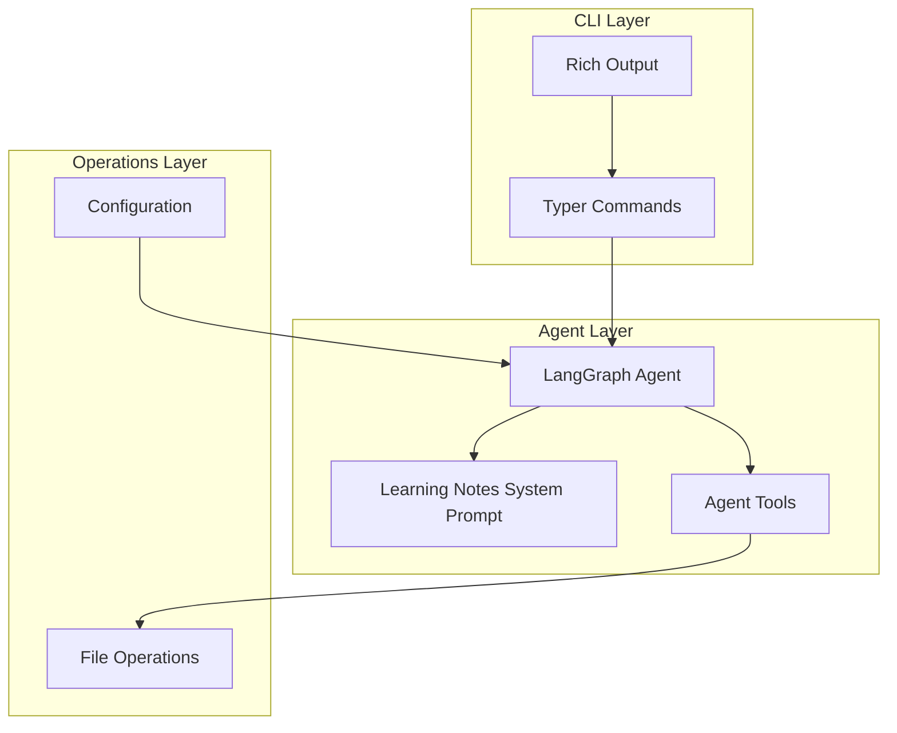

# File Agent Architecture

## Overview

The File Agent is a CLI application that uses LangGraph to orchestrate an AI agent capable of performing file operations through natural language commands. The agent is specialized as a "Learning Notes Assistant" to help users process and organize study materials.

## Architecture Diagram



## Component Overview

### CLI Layer (`cli.py`)

The CLI layer uses **Typer** for command parsing and **Rich** for beautiful terminal output.

**Commands:**
- `create`: Create new files via natural language
- `edit`: Edit existing files
- `show`: Display file contents with syntax highlighting
- `chat`: General conversation mode
- `list`: List directory contents

**Features:**
- Progress indicators for long-running operations
- Syntax highlighting for code files
- Formatted tables for directory listings
- Color-coded error messages

### Agent Layer (`agent.py`)

The agent layer uses **LangGraph** to create a ReAct-style agent that can:
1. Understand natural language requests
2. Decide which tools to use
3. Execute file operations
4. Return results to the user

**Agent Graph Structure:**
```
Entry Point → Agent Node → Conditional Edge
                              ├─→ Tools Node → Agent Node (loop)
                              └─→ End
```

**State Management:**
- Maintains conversation history
- Tracks tool calls and responses
- Preserves context across multi-step operations

**Tools Available:**
- `create_file_tool`: Create new files
- `edit_file_tool`: Edit existing files (replace/append)
- `show_file_tool`: Display file contents
- `delete_file_tool`: Delete files (with confirmation)
- `list_directory_tool`: List directory contents

### Operations Layer

#### File Operations (`file_ops.py`)

Provides safe, validated file operations:
- **Path Validation**: Prevents directory traversal attacks
- **Size Limits**: Enforces maximum file size
- **Error Handling**: Comprehensive error messages
- **Metadata**: File size, modification time, etc.

#### Configuration (`config.py`)

Manages application configuration:
- Loads environment variables from `.env` file
- Validates required settings (API keys)
- Provides defaults for optional settings
- Secure API key management

#### Utilities (`utils.py`)

Helper functions:
- Path validation and sanitization
- File size formatting
- Filename sanitization

### Prompt System (`prompts.py`)

Contains the Learning Notes Assistant system prompt, which:
- Defines the agent's persona and capabilities
- Provides guidelines for file operations
- Supports flag-based modifications (brief, detailed, flashcards, etc.)

## Data Flow

### Creating a File

1. User runs: `file-agent create "a Python script"`
2. CLI parses command and flags
3. CLI calls `run_agent()` with prompt
4. Agent creates LangGraph instance
5. Agent invokes graph with user prompt
6. LLM decides to use `create_file_tool`
7. Tool executes file operation
8. Result returned to agent
9. Agent formats response
10. CLI displays result with Rich formatting

### Editing a File

1. User runs: `file-agent edit file.py "add error handling"`
2. Agent may first call `show_file_tool` to read current content
3. Agent processes request and calls `edit_file_tool`
4. Tool validates path and performs edit
5. Result returned to user

## Security Features

### Path Validation

All file paths are validated using `validate_path()`:
- Resolves relative paths to absolute
- Ensures path stays within base directory
- Prevents directory traversal (`../` attacks)

### File Size Limits

- Default: 10MB per file
- Configurable via `MAX_FILE_SIZE` environment variable
- Prevents memory exhaustion and abuse

### API Key Security

- Never hardcoded in source
- Loaded from environment variables
- `.env` file excluded from version control

## Error Handling

### Configuration Errors

- Missing API key: Clear error message with setup instructions
- Invalid configuration: Validation errors with suggestions

### File Operation Errors

- File not found: Descriptive error message
- Permission denied: Clear explanation
- Path validation failures: Security-focused error messages

### Agent Errors

- Tool execution failures: Error messages from tools
- LLM errors: Graceful degradation with error context

## Extension Points

### Adding New Tools

1. Create tool function in `agent.py` with `@tool` decorator
2. Add to `tools` list
3. Update system prompt if needed
4. Tool automatically available to agent

### Adding New Commands

1. Add command function to `cli.py` with `@app.command()` decorator
2. Parse arguments and flags
3. Call `run_agent()` with appropriate prompt
4. Display results with Rich formatting

### Customizing Prompts

1. Modify `LEARNING_NOTES_SYSTEM_PROMPT` in `prompts.py`
2. Update `get_system_prompt()` for flag-based modifications
3. Agent will use new prompt on next invocation

## Performance Considerations

- **Caching**: LangGraph maintains conversation state
- **File Size Limits**: Prevent memory issues
- **Async Potential**: Can be extended for async operations
- **Streaming**: Can add streaming responses for long operations

## Testing Strategy

### Unit Tests

- File operations: Test each operation in isolation
- Configuration: Test env var loading and validation
- Utilities: Test path validation and sanitization

### Integration Tests

- Agent workflow: Test full agent execution
- CLI commands: Test command parsing and execution
- Tool integration: Test tools within agent context

## Future Enhancements

- Interactive mode for multi-turn conversations
- File operation history/undo
- Template support for common file types
- Git integration for version control
- Batch operations on multiple files
- Custom prompt templates per language
