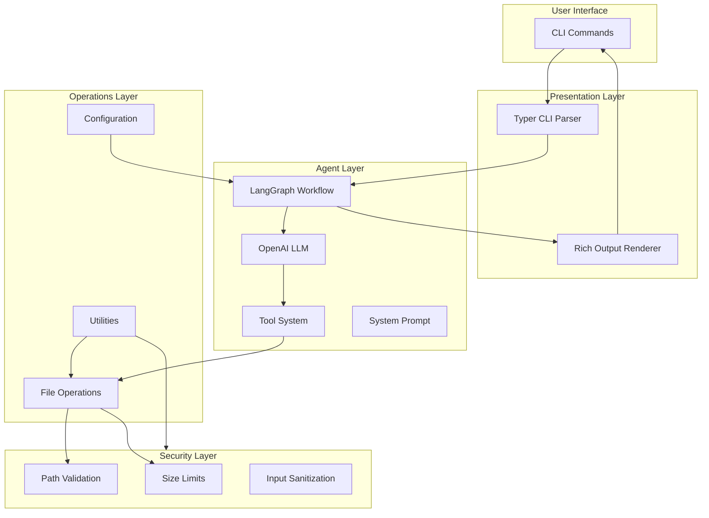
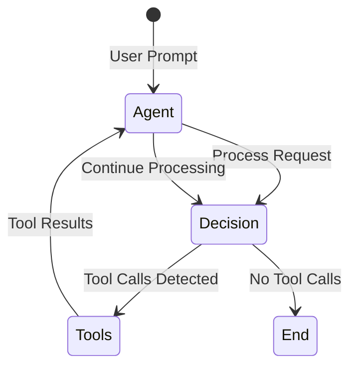
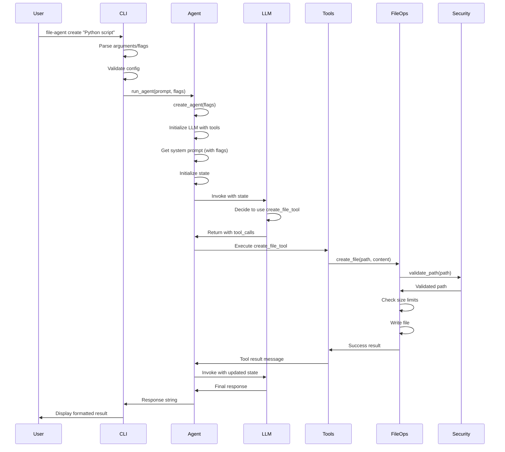
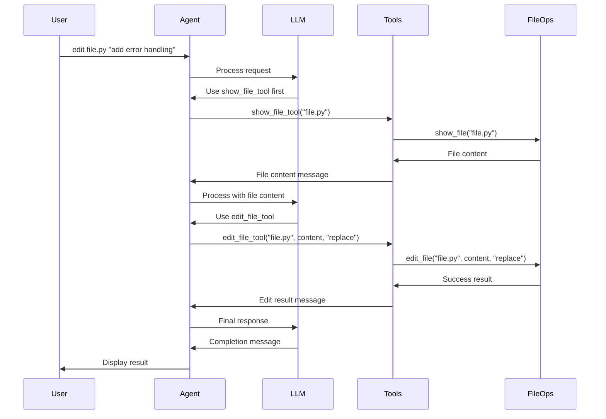
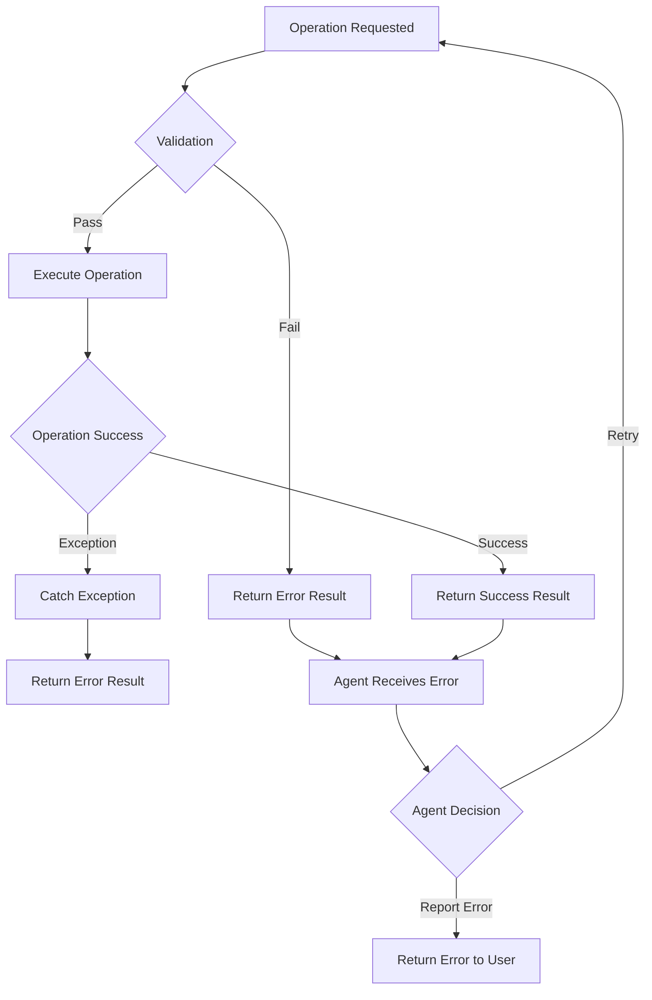

# File Agent - Comprehensive Project Notes

## Table of Contents

1. [Project Overview](#project-overview)
2. [Architecture Deep Dive](#architecture-deep-dive)
3. [Component Documentation](#component-documentation)
4. [Data Flow](#data-flow)
5. [Security Architecture](#security-architecture)
6. [Development Workflow](#development-workflow)
7. [Technical Decisions](#technical-decisions)
8. [Future Enhancements](#future-enhancements)

---

## Project Overview

### Purpose and Goals

The File Agent is a command-line interface (CLI) application that leverages AI to perform file operations through natural language commands. The project combines the power of LangGraph for agent orchestration, OpenAI's GPT models for natural language understanding, and a specialized "Learning Notes Assistant" persona to help users create, edit, and organize study materials and code files.

### Target Use Cases

1. **Learning Assistance**: Students and lifelong learners can process, summarize, and rewrite study materials in various formats (Cornell notes, flashcards, mind maps, etc.)
2. **Code Generation**: Developers can quickly create files, refactor code, and generate project structures using natural language
3. **File Management**: Users can perform file operations (create, edit, show, delete, list) through intuitive commands
4. **Content Transformation**: Convert between different formats and complexity levels (beginner to advanced)

### Key Features

- **Natural Language Interface**: All operations use plain English descriptions
- **AI-Powered Agent**: LangGraph-based agent with tool-calling capabilities
- **Learning Notes Specialization**: Specialized system prompt for educational content processing
- **Multiple Output Formats**: Support for brief, detailed, beginner, advanced, flashcards, Cornell notes, mind maps, and question generation
- **Security First**: Path validation, file size limits, and input sanitization
- **Beautiful CLI**: Rich terminal output with syntax highlighting, tables, and progress indicators
- **Extensible Architecture**: Easy to add new tools, commands, and features

---

## Architecture Deep Dive

### System Architecture

The File Agent follows a layered architecture with clear separation of concerns:



### Design Patterns

1. **Agent Pattern**: The LangGraph agent follows the ReAct (Reasoning + Acting) pattern, where the agent reasons about what to do, acts using tools, and observes results
2. **Tool Pattern**: File operations are exposed as tools that the agent can call, following the function-calling pattern
3. **State Management**: Conversation state is maintained in a TypedDict, allowing the agent to maintain context across multiple tool calls
4. **Command Pattern**: CLI commands are implemented as separate functions, each handling a specific operation
5. **Configuration Pattern**: Centralized configuration management with environment variable support

### State Management Approach

The agent uses LangGraph's state management system:

- **State Structure**: `AgentState` TypedDict contains a list of messages
- **Message Types**: HumanMessage, AIMessage, SystemMessage, ToolMessage
- **State Persistence**: State is maintained throughout the workflow execution
- **Tool Results**: Tool execution results are added to the state as ToolMessages
- **Context Preservation**: Full conversation history is maintained, allowing multi-step reasoning

### Workflow Graph Structure



The workflow loops between the agent node and tools node until the agent completes without requesting tool execution.

---

## Component Documentation

### CLI Layer (`cli.py`)

The CLI layer provides the user interface using Typer for command parsing and Rich for enhanced output.

#### Command Structure

All commands follow a consistent pattern:
1. Parse arguments and flags
2. Validate configuration
3. Show progress indicator
4. Execute agent operation
5. Display formatted results

#### Available Commands

**`create`**: Create new files
- Takes a natural language description
- Supports all format flags (brief, detailed, beginner, advanced, etc.)
- Displays success message and agent response

**`edit`**: Edit existing files
- Requires file path and edit description
- Agent reads file first, then applies edits
- Supports all format flags

**`show`**: Display file contents
- Syntax highlighting based on file extension
- Shows file metadata (path, size)
- Uses Rich Syntax for code display

**`chat`**: General conversation mode
- Most flexible command
- Agent decides which operations to perform
- Supports multi-step workflows

**`list`**: List directory contents
- Formatted table with files and directories
- Shows file sizes
- Sorted alphabetically

#### Flag System

The flag system allows customization of agent behavior:

- **`--brief`**: Ultra-concise summaries
- **`--detailed`**: Comprehensive breakdowns
- **`--beginner`**: Simplified for novices
- **`--advanced`**: Sophisticated analysis
- **`--questions`**: Focus on test questions
- **`--flashcards`**: Q&A pair format
- **`--cornell`**: Cornell note format
- **`--mindmap`**: Hierarchical concept maps

Flags are passed to the agent via the system prompt modification system.

#### Rich Integration

- **Progress Indicators**: SpinnerColumn for long operations
- **Syntax Highlighting**: Monokai theme for code files
- **Tables**: Formatted directory listings
- **Panels**: Bordered agent responses
- **Colors**: Color-coded success/error messages

#### Error Handling

- Configuration errors: Clear messages with setup instructions
- File operation errors: Descriptive error messages
- Validation errors: Security-focused error messages
- All errors exit with appropriate status codes

### Agent Layer (`agent.py`)

The agent layer implements the LangGraph workflow and tool system.

#### LangGraph Workflow

The workflow consists of:

1. **Agent Node**: Calls the LLM with current state
2. **Tools Node**: Executes tool calls requested by the agent
3. **Conditional Edges**: Routes between nodes based on tool call presence
4. **Loop**: Continues until agent completes without tool calls

#### Tool System

Tools are implemented using LangChain's `@tool` decorator:

1. **`create_file_tool`**: Create new files with content
2. **`edit_file_tool`**: Edit existing files (replace/append)
3. **`show_file_tool`**: Read and display file contents
4. **`delete_file_tool`**: Delete files (with confirmation)
5. **`list_directory_tool`**: List directory contents

Each tool:
- Validates inputs
- Calls underlying file operations
- Returns formatted results
- Handles errors gracefully

#### State Management

- **Initialization**: State starts with user's HumanMessage
- **System Message**: Added automatically if not present
- **Tool Calls**: Agent messages may contain tool_calls
- **Tool Results**: Tool execution adds ToolMessages to state
- **Final Response**: Last message content is extracted

#### Decision Flow

The `should_continue` function implements the routing logic:

```python
if last_message has tool_calls:
    return "tools"  # Execute tools
else:
    return "end"    # Complete workflow
```

This creates a loop where the agent can:
1. Reason about the request
2. Call tools as needed
3. Process tool results
4. Continue reasoning
5. Return final answer

### File Operations (`file_ops.py`)

The file operations module provides safe, validated file operations.

#### Operation Types

**Create File**:
- Validates path (prevents directory traversal)
- Creates parent directories if needed
- Checks file size limits
- Writes UTF-8 encoded content
- Returns success/error result

**Edit File**:
- Validates path and file existence
- Supports replace and append modes
- Checks size limits (current + new content)
- Preserves existing content in append mode
- Returns success/error result

**Show File**:
- Validates path and file existence
- Checks size limits
- Reads file content
- Determines language for syntax highlighting
- Returns content with metadata

**Delete File**:
- Validates path and file existence
- Requires explicit confirmation
- Permanently deletes file
- Returns success/error result

**List Directory**:
- Validates path and directory existence
- Lists files and subdirectories
- Formats file sizes
- Sorts alphabetically
- Returns directory contents

#### Security Measures

1. **Path Validation**: All paths validated using `validate_path()`
2. **Size Limits**: Files checked against `MAX_FILE_SIZE` configuration
3. **Existence Checks**: Operations verify file/directory existence
4. **Type Checks**: Directory operations verify path is a directory
5. **Error Handling**: Comprehensive error messages without exposing internals

#### Error Handling

All operations return a consistent result dictionary:

```python
{
    "success": bool,
    "message": str,
    "path": str,
    # Additional fields based on operation
}
```

Errors are caught and returned as failure results, never raised as exceptions.

### Configuration (`config.py`)

The configuration module manages application settings.

#### Environment Variable System

Configuration is loaded from:
1. Environment variables (highest priority)
2. `.env` file in current directory
3. Default values (lowest priority)

#### Configuration Values

- **`OPENAI_API_KEY`**: Required for API authentication
- **`OPENAI_MODEL`**: Model to use (default: "gpt-4o")
- **`MAX_FILE_SIZE`**: Maximum file size in bytes (default: 10MB)

#### Validation Logic

The `validate()` method ensures:
- Required configuration is present
- Clear error messages with setup instructions
- Validation before agent creation

#### Default Values

- Model: "gpt-4o" (OpenAI's latest model)
- Max file size: 10MB (10485760 bytes)
- API key: None (must be set)

### Utilities (`utils.py`)

Utility functions provide common functionality across the application.

#### Path Validation Algorithm

The `validate_path()` function:

1. Converts input to Path object
2. Resolves to absolute path
3. Checks if resolved path is within base directory
4. Uses `Path.relative_to()` to verify containment
5. Raises ValueError if path escapes base directory

**Security Considerations**:
- Prevents directory traversal attacks (`../` sequences)
- Handles both relative and absolute paths
- Ensures all operations stay within working directory
- Critical security function used by all file operations

#### Filename Sanitization

The `sanitize_filename()` function:

1. Removes dangerous characters: `/`, `\`, `..`, `<`, `>`, `:`, `"`, `|`, `?`, `*`
2. Replaces with underscores
3. Strips leading/trailing dots and spaces
4. Returns sanitized filename

**Security Considerations**:
- Defense-in-depth measure
- Primary security is path validation
- Prevents issues with special characters
- Used for additional safety

#### File Size Functions

**`get_file_size()`**:
- Uses `Path.stat().st_size`
- Returns size in bytes
- Raises OSError if file inaccessible

**`format_file_size()`**:
- Converts bytes to human-readable format
- Uses binary units (1024 bytes per KB)
- Supports B, KB, MB, GB, TB
- Returns formatted string with one decimal place

### Prompts (`prompts.py`)

The prompts module contains the system prompt and modification logic.

#### System Prompt Structure

The `LEARNING_NOTES_SYSTEM_PROMPT` defines:

1. **Agent Persona**: Learning Notes Assistant
2. **Core Mission**: Transform study materials into learning resources
3. **Capabilities**: Summarization, rewriting, learning enhancement, format optimization
4. **Communication Style**: Clarity, structure, learning-focused
5. **Working Principles**: Accuracy, learning levels, active learning, context, uncertainty
6. **File Operation Guidelines**: Best practices for file operations
7. **Example Interactions**: Sample workflows
8. **Response Format Guidelines**: Structured output format
9. **Quality Standards**: Accuracy, clarity, structure, actionability, completeness
10. **Special Commands**: Flag descriptions

#### Flag-Based Modifications

The `get_system_prompt()` function:

1. Starts with base prompt
2. Checks each flag in the flags dictionary
3. Appends mode-specific instructions for active flags
4. Returns modified prompt

**Flag Modifications**:
- Each flag adds a "Current Mode" section
- Multiple flags can be active simultaneously
- Instructions guide agent behavior
- Maintains base prompt structure

---

## Data Flow

### File Creation Workflow



### File Editing Workflow



### Multi-Step Operations

The agent can perform complex multi-step operations:

1. **Read Context**: Use `show_file_tool` to read relevant files
2. **List Directory**: Use `list_directory_tool` to explore structure
3. **Create Files**: Use `create_file_tool` to generate new files
4. **Edit Files**: Use `edit_file_tool` to modify existing files
5. **Reason**: Process information between tool calls
6. **Complete**: Return final response

### Error Propagation



---

## Security Architecture

### Path Validation Mechanism

The path validation system is the primary security mechanism:

1. **Input Sanitization**: Filenames sanitized to remove dangerous characters
2. **Path Resolution**: All paths resolved to absolute paths
3. **Boundary Check**: Resolved paths checked against base directory
4. **Relative Path Check**: Uses `Path.relative_to()` to ensure containment
5. **Error Handling**: Clear error messages without exposing internals

**Attack Prevention**:
- Directory traversal (`../` sequences)
- Absolute path attacks
- Symbolic link attacks (via resolve())
- Path injection attacks

### Directory Traversal Prevention

The `validate_path()` function specifically prevents:

- `../../../etc/passwd` - Escaping to parent directories
- `/etc/passwd` - Absolute paths outside working directory
- `./../../secret` - Relative paths with parent navigation
- `//absolute/path` - Double-slash absolute paths

All paths must be subpaths of the base directory.

### File Size Limits

**Purpose**: Prevent memory exhaustion and abuse

**Implementation**:
- Default limit: 10MB (10485760 bytes)
- Configurable via `MAX_FILE_SIZE` environment variable
- Checked before read/write operations
- Human-readable error messages

**Protection Against**:
- Memory exhaustion from large files
- Denial of service attacks
- Accidental processing of huge files
- Resource abuse

### API Key Management

**Security Measures**:
- Never hardcoded in source code
- Loaded from environment variables
- `.env` file support for local development
- `.env` excluded from version control
- Validation before use
- Clear error messages if missing

**Best Practices**:
- Use environment variables in production
- Use `.env` file for local development only
- Never commit `.env` files
- Rotate keys regularly
- Use least-privilege API keys

### Input Sanitization

**Filename Sanitization**:
- Removes path separators (`/`, `\`)
- Removes parent directory references (`..`)
- Removes special characters (`<`, `>`, `:`, `"`, `|`, `?`, `*`)
- Strips leading/trailing dots and spaces

**Content Validation**:
- UTF-8 encoding validation
- Size limit enforcement
- Type checking (file vs directory)

### Confirmation for Destructive Operations

**Delete Operations**:
- Require explicit `confirm=True` parameter
- Tool automatically confirms (for agent use)
- CLI could add interactive confirmation in future

**Safety Measures**:
- Cannot delete without confirmation
- Clear error messages
- Path validation prevents accidental deletion of system files

---

## Development Workflow

### Setup Process

1. **Clone Repository**: Get the project code
2. **Install Poetry**: Dependency management tool
3. **Install Dependencies**: `poetry install`
4. **Set Environment Variables**: Create `.env` file with `OPENAI_API_KEY`
5. **Install Package**: `poetry run pip install -e .` or `poetry shell`
6. **Verify Installation**: Run `file-agent --version`

### Testing Strategy

**Unit Tests**:
- File operations: Test each operation in isolation
- Configuration: Test env var loading and validation
- Utilities: Test path validation and sanitization
- Mock external dependencies (API calls, file system)

**Integration Tests**:
- Agent workflow: Test full agent execution
- CLI commands: Test command parsing and execution
- Tool integration: Test tools within agent context
- End-to-end: Test complete user workflows

**Test Structure**:
```
tests/
├── test_config.py      # Configuration tests
├── test_file_ops.py    # File operation tests
├── test_utils.py       # Utility function tests
└── test_agent.py       # Agent workflow tests (future)
```

### Code Quality Tools

**Black**: Code formatting
- Line length: 100
- Target version: Python 3.10
- Run: `poetry run black file_agent tests`

**MyPy**: Type checking
- Strict mode enabled
- Warn on return any
- Disallow untyped definitions
- Run: `poetry run mypy file_agent`

**Ruff**: Linting
- Fast Python linter
- Catches common errors
- Run: `poetry run ruff check file_agent tests`

**Pytest**: Testing
- Test discovery
- Coverage reporting
- Run: `poetry run pytest`
- With coverage: `poetry run pytest --cov=file_agent --cov-report=html`

### Extension Points

#### Adding New Tools

1. Create tool function in `agent.py`:
```python
@tool
def new_tool(param: str) -> str:
    """Tool description."""
    # Implementation
    return result
```

2. Add to tools list:
```python
tools = [
    create_file_tool,
    edit_file_tool,
    # ... existing tools
    new_tool,  # Add here
]
```

3. Update system prompt if needed
4. Tool automatically available to agent

#### Adding New Commands

1. Add command function to `cli.py`:
```python
@app.command()
def new_command(
    arg: str = typer.Argument(...),
    flag: bool = typer.Option(False, "--flag"),
) -> None:
    """Command description."""
    # Implementation
```

2. Parse arguments and flags
3. Call `run_agent()` with appropriate prompt
4. Display results with Rich formatting

#### Customizing Prompts

1. Modify `LEARNING_NOTES_SYSTEM_PROMPT` in `prompts.py`
2. Update `get_system_prompt()` for flag-based modifications
3. Agent uses new prompt on next invocation

#### Adding New Format Flags

1. Add flag parameter to CLI commands
2. Add flag to flags dictionary
3. Add flag handling in `get_system_prompt()`
4. Update system prompt with flag instructions

---

## Technical Decisions

### Why LangGraph?

**Reasons**:
1. **State Management**: Built-in state management for conversation context
2. **Tool Integration**: Seamless integration with LangChain tools
3. **Workflow Control**: Explicit control flow with conditional edges
4. **Extensibility**: Easy to add new nodes and edges
5. **Debugging**: Clear visualization of workflow execution
6. **Community**: Active development and community support

**Alternatives Considered**:
- **LangChain Agents**: Less control over workflow
- **Custom Implementation**: More maintenance overhead
- **Other Frameworks**: Less mature or less Pythonic

### Tool Design Choices

**Function-Calling Pattern**:
- Uses LangChain's `@tool` decorator
- Automatic schema generation
- Type hints for validation
- Clear tool descriptions for LLM

**Tool Wrapper Pattern**:
- Tools wrap underlying file operations
- Consistent error handling
- Formatted return values
- Agent-friendly interface

**Why Not Direct File Operations**:
- Separation of concerns
- Consistent error handling
- Tool-specific formatting
- Future extensibility

### State Management Approach

**TypedDict for State**:
- Type safety
- Clear state structure
- Easy to extend
- IDE support

**Message List Pattern**:
- Standard LangChain pattern
- Conversation history
- Tool result integration
- LLM compatibility

**Why Not Custom State**:
- LangChain compatibility
- Standard patterns
- Less maintenance
- Better tool integration

### Error Handling Strategy

**Result Dictionary Pattern**:
- Consistent return format
- Success/failure indication
- Error messages
- No exceptions in normal flow

**Why Not Exceptions**:
- Agent-friendly error handling
- Consistent interface
- Easier tool integration
- Better user experience

**Error Propagation**:
- Errors returned as messages
- Agent can reason about errors
- User gets clear messages
- No stack traces exposed

### Configuration Management

**Environment Variables**:
- Standard practice
- Security (no hardcoded secrets)
- Environment-specific configs
- Easy deployment

**`.env` File Support**:
- Local development convenience
- Version control exclusion
- Easy setup for new developers
- Production uses env vars

**Centralized Config**:
- Single source of truth
- Validation in one place
- Easy to extend
- Type-safe access

---

## Future Enhancements

### Planned Features

1. **Interactive Mode**: Multi-turn conversations without re-invoking commands
2. **File Operation History**: Track and undo file operations
3. **Template Support**: Common file type templates (FastAPI, React, etc.)
4. **Git Integration**: Automatic version control operations
5. **Batch Operations**: Operate on multiple files simultaneously
6. **Custom Prompt Templates**: Language-specific prompt templates
7. **Streaming Responses**: Real-time response streaming for long operations
8. **Configuration Profiles**: Save and load configuration profiles
9. **Plugin System**: Third-party tool and command plugins
10. **Web Interface**: Optional web UI for non-CLI users

### Extension Possibilities

**New Tool Types**:
- Search tools (grep, find)
- Git operations
- Package management
- Code analysis
- Documentation generation

**New Output Formats**:
- Markdown variations
- LaTeX documents
- HTML presentations
- PDF generation
- Interactive notebooks

**Integration Opportunities**:
- IDE plugins (VS Code, PyCharm)
- Browser extensions
- Slack/Discord bots
- CI/CD integration
- Documentation generators

### Performance Optimizations

**Caching**:
- Conversation state caching
- File content caching
- Tool result caching
- Prompt template caching

**Async Operations**:
- Async file operations
- Async LLM calls
- Parallel tool execution
- Streaming responses

**Optimization Strategies**:
- Lazy loading of modules
- Connection pooling for API calls
- Batch API requests
- Local model support (future)

### Architecture Improvements

**Modular Design**:
- Plugin architecture
- Tool registry system
- Command registry system
- Configuration profiles

**Testing Enhancements**:
- Mock LLM for testing
- Integration test suite
- Performance benchmarks
- Security testing

**Documentation**:
- API documentation
- Architecture diagrams
- Tutorial videos
- Example gallery

---

## Conclusion

The File Agent project demonstrates a modern approach to CLI tooling with AI integration. The architecture is designed for extensibility, security, and maintainability. The specialized Learning Notes Assistant persona makes it particularly useful for educational use cases, while the general file operations make it valuable for developers.

Key strengths:
- **Security**: Comprehensive path validation and input sanitization
- **Usability**: Natural language interface with beautiful output
- **Extensibility**: Easy to add tools, commands, and features
- **Maintainability**: Clean architecture with clear separation of concerns
- **Documentation**: Comprehensive docstrings and project notes

The project serves as a foundation for building more sophisticated AI-powered CLI tools and demonstrates best practices for integrating LLMs into practical applications.
